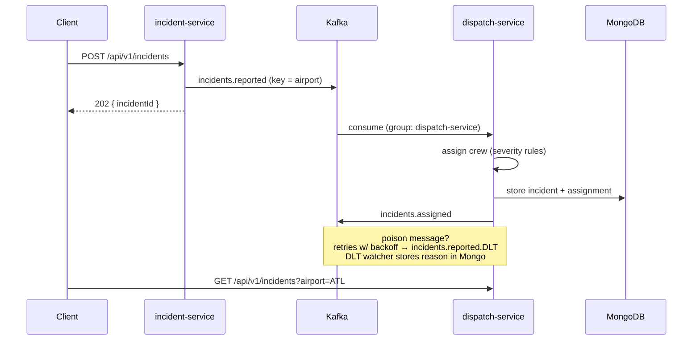

# tarmac


Event-driven incident dispatch for airport ground ops: two Spring Boot services that only know each other through Kafka. Equipment breaks → `incident-service` takes the report over REST and publishes an event → `dispatch-service` consumes it, assigns a maintenance crew, stores it in MongoDB, and emits an assignment event. Messages that can't be processed go to a dead-letter topic with the failure reason — recorded and queryable, not lost.

Java 17 · Spring Boot 3 · Spring Kafka · MongoDB · Docker · Embedded-Kafka + Testcontainers tests



## Run it

```bash
docker compose up --build
# incident-service on :8092, dispatch-service on :8093, kafka on :9094, mongo on :27018
```

Report something broken:

```bash
curl -X POST localhost:8092/api/v1/incidents \
  -H "Content-Type: application/json" \
  -d '{"airport":"ATL","equipment":"BAGGAGE_CONVEYOR","severity":"CRITICAL","laneName":"Lane 4","description":"belt jammed at intake"}'
```

Watch it come out the other side, crewed and stored:

```bash
curl localhost:8093/api/v1/incidents?airport=ATL | python3 -m json.tool
```

Now poison the topic on purpose and watch the dead-letter path do its job:

```bash
docker compose exec kafka kafka-console-producer.sh \
  --bootstrap-server localhost:9092 --topic incidents.reported
> this is not json
> ^D

curl localhost:8093/api/v1/deadletters | python3 -m json.tool
```

The garbage never blocks the partition, never crashes the consumer, and shows up with its failure reason attached.

## What's actually being demonstrated

- **Partitioning with intent** — the airport is the message key, so events for one airport stay ordered on one partition, and partition count (3) is the ceiling on consumer parallelism. Ordering where it matters, scale where it doesn't.
- **At-least-once + idempotency** — the producer runs `acks=all` with idempotence; the consumer treats the event id as the Mongo document id, so redelivery overwrites instead of duplicating. No dedupe bookkeeping.
- **Retry with backoff, then dead-letter** — transient failures retry 3× exponentially (500ms → 1s → 2s). Unfixable ones (unparseable JSON, events missing required fields) are classified not-retryable and go straight to `incidents.reported.DLT` on the same partition. A DLT watcher persists them with the exception message → `GET /api/v1/deadletters`.
- **Choreography over orchestration** — dispatch doesn't answer to anyone; it reacts to `incidents.reported` and announces on `incidents.assigned`. Adding a notifications service later means adding a consumer, not changing either existing service.
- **Contracts without a shared jar** — both services carry their own copy of the event shape (tolerant reader: unknown fields ignored). The upgrade path to a schema registry is documented in the code, not hand-waved.
- **Honest 202** — the REST intake blocks briefly for the broker ack before answering, so 202 means "durably in Kafka," not "probably."

## Services

| Service | Port | Role | Storage |
|---|---|---|---|
| incident-service | 8092 | REST intake → Kafka producer | none (stateless) |
| dispatch-service | 8093 | consumer → crew assignment → query API | MongoDB |

Dispatch API: `GET /api/v1/incidents` (`?airport=`, `?severity=`), `GET /api/v1/incidents/{id}`, `GET /api/v1/deadletters`.

## Tests

```bash
mvn verify
```

incident-service boots against an **embedded Kafka broker** (no Docker needed) — a test consumer proves the event really landed, right key, right payload. dispatch-service runs the full choreography against embedded Kafka plus a **real MongoDB via Testcontainers**: good event → stored + assigned + re-emitted; garbage + structurally-invalid events → both in the DLT with reasons, neither stored, partition unblocked. Crew assignment rules are pinned by plain unit tests.

## Layout

```
incident-service/
  api/         REST intake, validation, error shapes
  config/      topic declarations (partitions/replicas in code)
  event/       producer-side event contract
dispatch-service/
  messaging/   main listener + DLT watcher
  config/      retry/backoff/dead-letter policy, DLT consumer factory
  service/     crew assignment rules
  domain/ repository/ api/   Mongo documents, queries, REST
docker-compose.yml   kafka (KRaft) + mongo + both services
```
